CUDA Denoiser For CUDA Path Tracer
==================================

**University of Pennsylvania, CIS 565: GPU Programming and Architecture, Project 4**

* Saksham Nagpal  
  * [LinkedIn](https://www.linkedin.com/in/nagpalsaksham/)
* Tested on: Windows 11 Home, AMD Ryzen 7 6800H Radeon @ 3.2GHz 16GB, NVIDIA GeForce RTX 3050 Ti Laptop GPU 4096MB

## Summary
This project is a CUDA-based denoiser integrated into my [CUDA Pathtracer](https://github.com/Saksham03/CUDA-Path-Tracer) and is an implementation of the paper [Edge-Avoiding A-Trous Wavelet Transform for fast Global Illumination Filtering](https://jo.dreggn.org/home/2010_atrous.pdf) by the authors Dammertz, Sewtz, Hanika, and Lensch. In summary, the A-Trous Wavelet Transform is essentially a smoothing filter guided by various geometry buffers (G-Buffers). The algorithm is extended to incorporate an edge stopping function based on the input g-buffers that allows successful elimination of noise while preserving sharp edges. I will briefly go over the implementation details followed by an evaluation of the algorithm's qualitative as well as quantitative performance.  

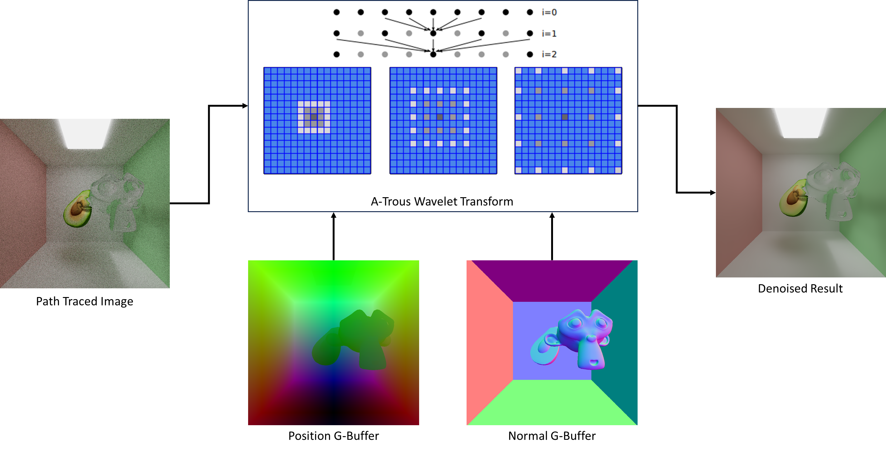

## Table of Contents

* [Visual Parity Analysis](#visual-h)
  1. [Are the results 'Visually Acceptable'?](#visual-1)
  2. [Effect of Filter Size](#visual-2)
  3. [Type of Scene](#visual-3)
* [Performance Analysis](#perf-h)
  1. [Denoising Overhead](#perf-1)
  2. [Image Resolution](#perf-2)
  3. [Filter Size](#perf-3)

# Visual Parity Analysis
In this section, I compare the results of the A-Trous Wavelet Transform Denoiser with the 'ground-truth' path-traced renders. I go over how good the denoised renders look, and how various parameters can affect the same.

## 1. Are the results 'Visually Acceptable'?
In this section, I tabulate how _well_ the denoiser performs at 1/10th iterations as that of the path tracer. I use [this](https://www.textcompare.org/image/) visual diffing tool to generate the images in the last column. These images signify the per-pixel differencce between the images in the first two columns, where the magenta color signifies unmatched values. As seen from the results, we can make some deductions:
1. Perfectly specular and diffuse materials are handled well by the denoising algorith.
2. Perfectly refractive materials work well for the most part, but we get some loss in the detailing.
3. Size of the light source also plays an important factor in generating good or bad visual parity.
4. Meshes with albedo mapping do take a hit from this algorithm, since the approximated blur makes the lose quite a bit of detailing.

| Pathtraced, 1000 iterations | Denoised, 100 iterations |  Difference |
|:--:|:--:|:--:|
| 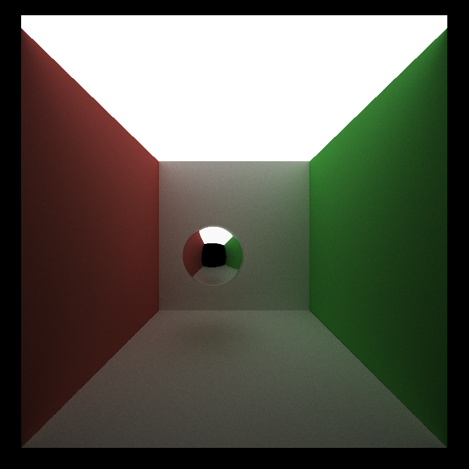 | 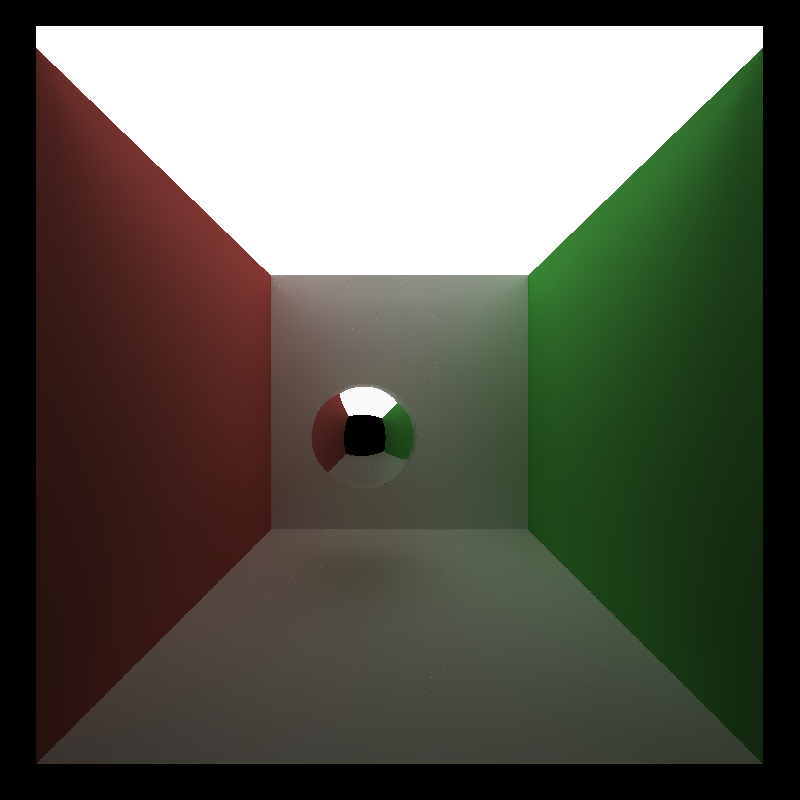 | 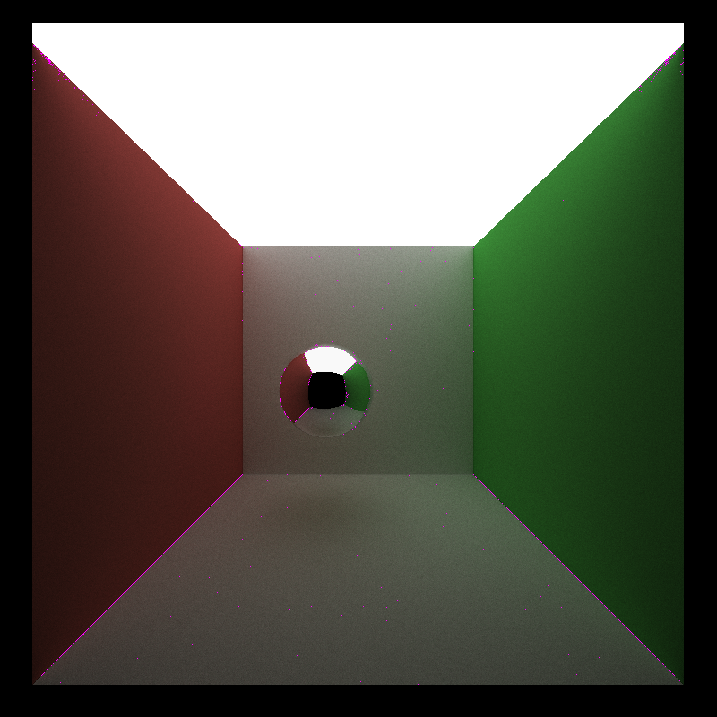 |
| 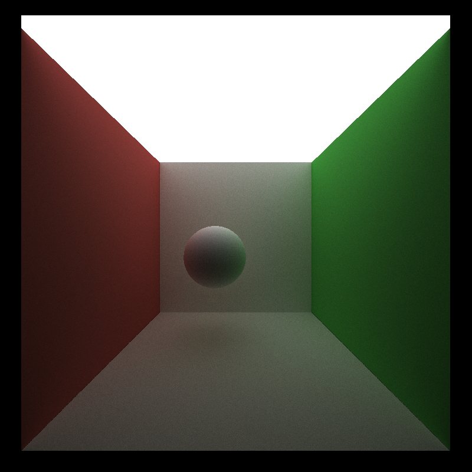 | 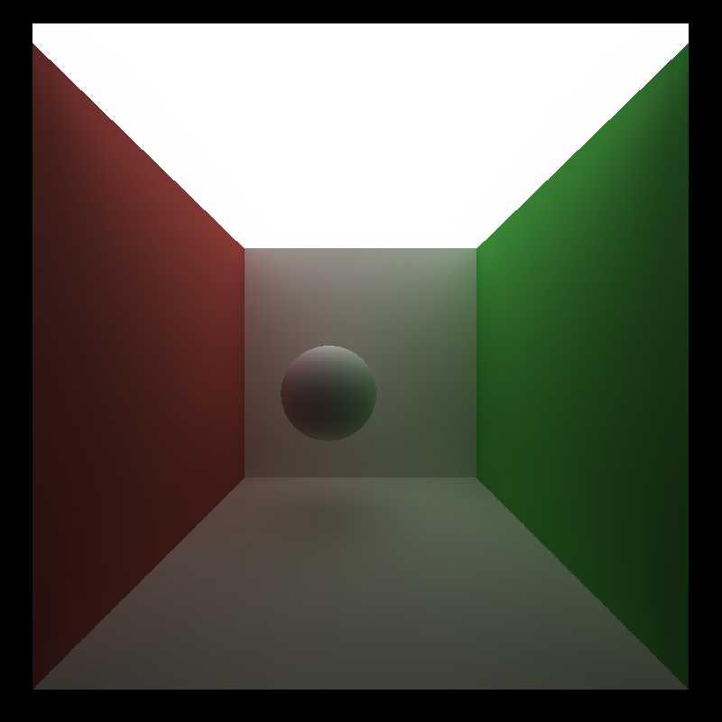 | 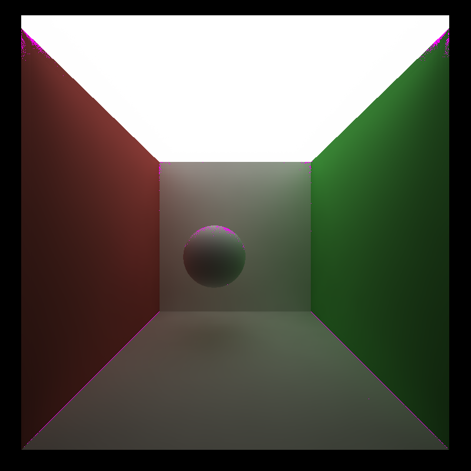 |
| 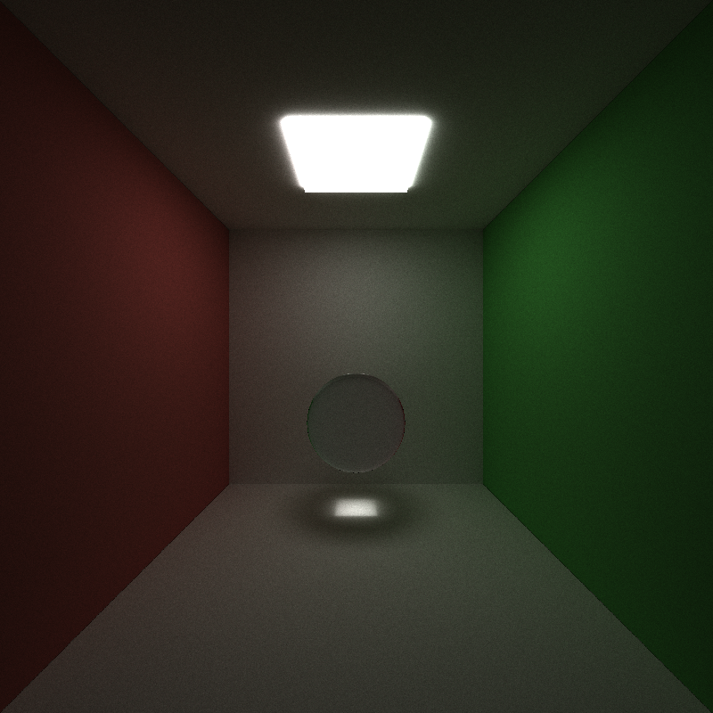 |  | 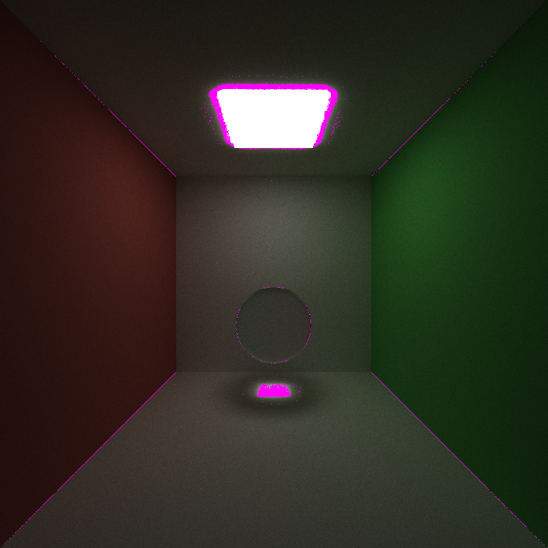 |

| Pathtraced, 5000 iterations | Denoised, 500 iterations |  Difference |
|:--:|:--:|:--:|
| 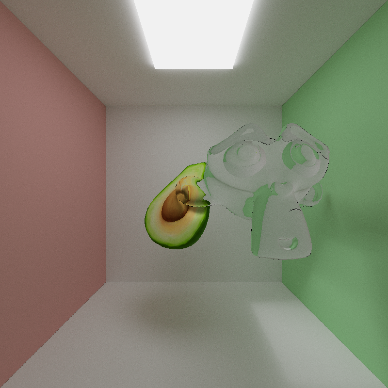 |  | 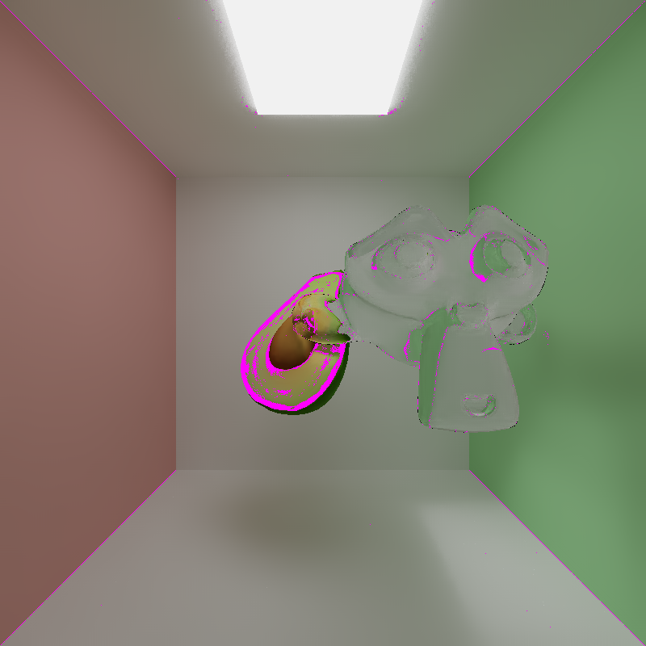 |

Overall, in summary, I think the denoiser's results are extremely acceptable given that they are generated using only 1/10th iterations as that of the path tracer, and the loss in visual quality is a trade-off that we can afford against the increase in computation time (as a result of decrease in the number of iterations).

## 2. Effect of Filter Size

In this section, I try different sizes of the filter resolution and see how it affects the visual quality of the renders. As shown later in the [Performance Analysis](#perf-h) section, a larger filter size is naturally going to cause the denoiser to take longer to generate the final render. In addition to that, an increasing filter size also means increasing the range of influence from neighboring pixels on a particular pixel. This can have results we might or might not want. In the table below, at each filter size I note down the observations for the same and compare it with the previous iteration.

| Filter Size | Resulting Render | Observation |
|:--:|:--:|:--:|
| None (Pathtraced) | 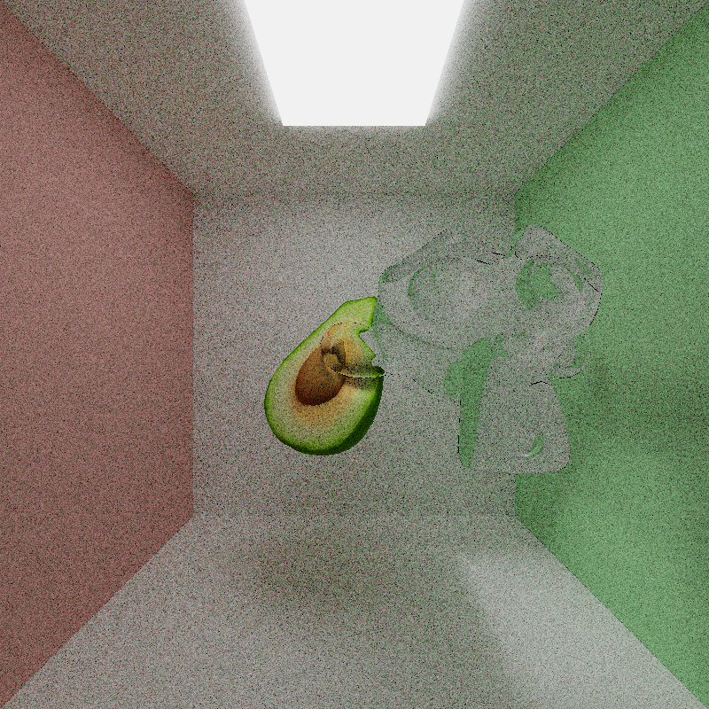 |Noisy render (100 iterations). To compare - visually notable features such as albedo mapping and refractive material.|
| 8X8 |  | With a small filter, the effect is limited as the filter spans across very limited pixels. |
| 16X16 | 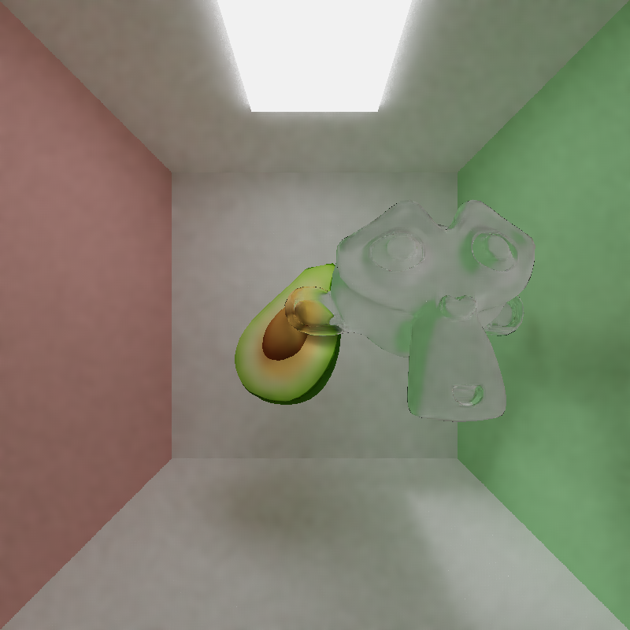 | Effect a bit more pronounced than the previous filter size, yet effect is limited. |
| 32X32 | 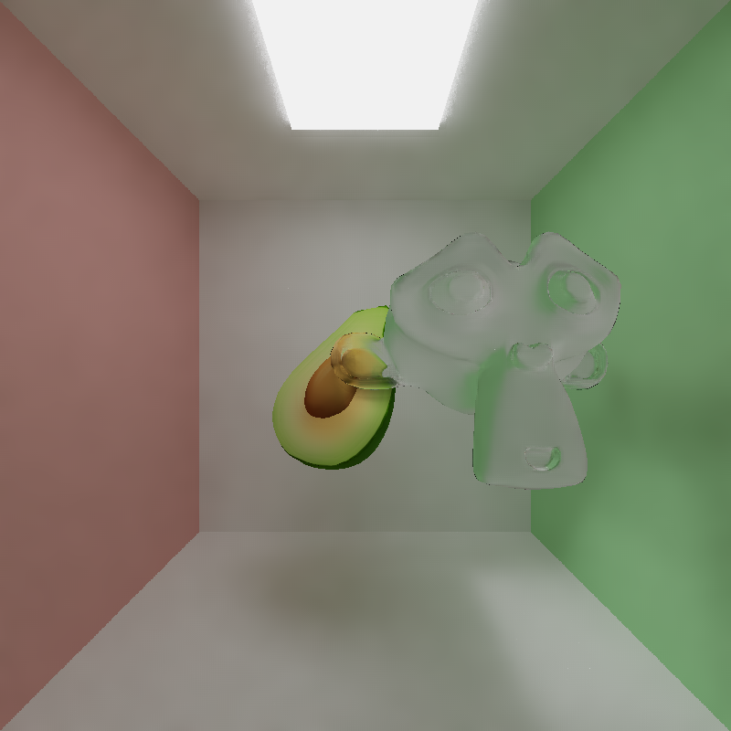 | Better clarity, however the albedo mapping seems to be getting too much blurred out. |
| 64X64 |  | At the cost of clarity, we lose more detail on the refractive material and albedo mapping. |
| 2048X2048 | 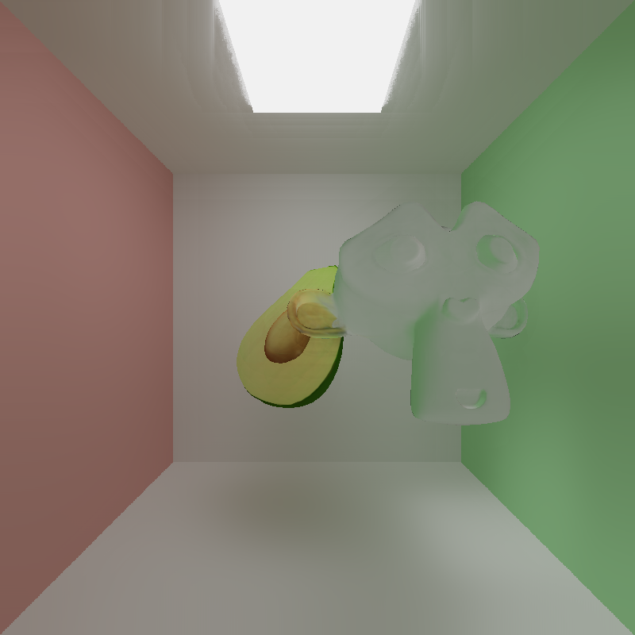 | Filter too large, albedos start bleeding over each other and refractive material loses a lot of detail. |

## 3. Type of Scene

|  |  |
|:--:|:--:|
| Larger light source, specular material | Smaller light source, refractive material |

A quick look at the `difference` image from the two scenes (where `difference` highlights the per-pixel difference between path-traced image and its equivalent denoised render at 1/10th iterations) highlights the following observations:
* Scenes with larger light sources get denoised better at fewer iterations. This is probably because during path tracing, more of our rays end up hitting the light source, and hence the denoiser has more useful data to work with. With smaller light sources, the path-traced image is going to have a lot of grainy spurious black spots. These will interfere when the denoiser's filter accounts them in the nieghbouring pixels while approximating a blur, and hence the final result will need a few more iterations to start looking visuallty acceptable.
* Material types also affect the quality of the final render, since it is not only the light's interaction with the material itself that varies but also the way how the light is further reflected into the scene. Each material's BSDF reflects light rays differently into the scene, which gets factored in when the denoiser is approximating the edge-avoiding blur. We see the caustics in the second image having the most noisy output which supports our stated hypothesis.
* The edges around the light source are also a good contributor to the image difference, which makes sense because of the potention 'bloom' effect that would happen during denoising. The negihbouring pixels from non-emitting sources will average out values from the pixels lying on the light source which will contribute abnormally higher rgb values due to the emissive property of the material.

# Performance Analysis

In this section, I take a look at some quantitative metrics that might help us dictate the performance of the denoiser in terms of its computational cost.

## 1. Denoising Overhead
The below image shows on a per-iteration basis that how much % of time we spend denoising VS path-tracing (the tests were performed on the cornell box scene named `cornell.txt` in the `scenes` directory and at a fixed filter size of 80x80):  

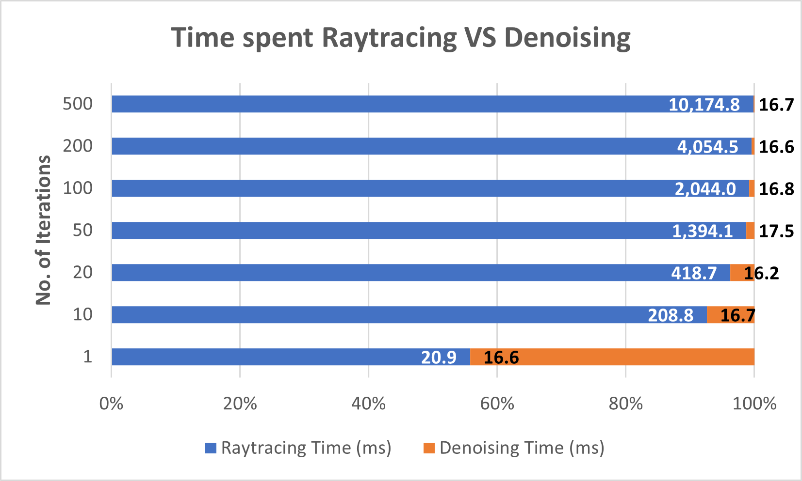 

Since we perform denoising only at the very end, and that too only once, we see that it takes almost a constant chunk of time regardless of the number of iterations we spend path-tracing. Consequently, we spend lesser and lesser proportion of time denoising our final render. This deterministic nature of the denoiser can be useful in accurately accounting for its overhead in varying cases.

## 2. Image Resolution

The following graph depicts the trend followed by the time taken by the denoiser as a function of the resolution of the final render (the tests were performed on the cornell box scene named `cornell.txt` in the `scenes` directory and at a fixed filter size of 80x80):

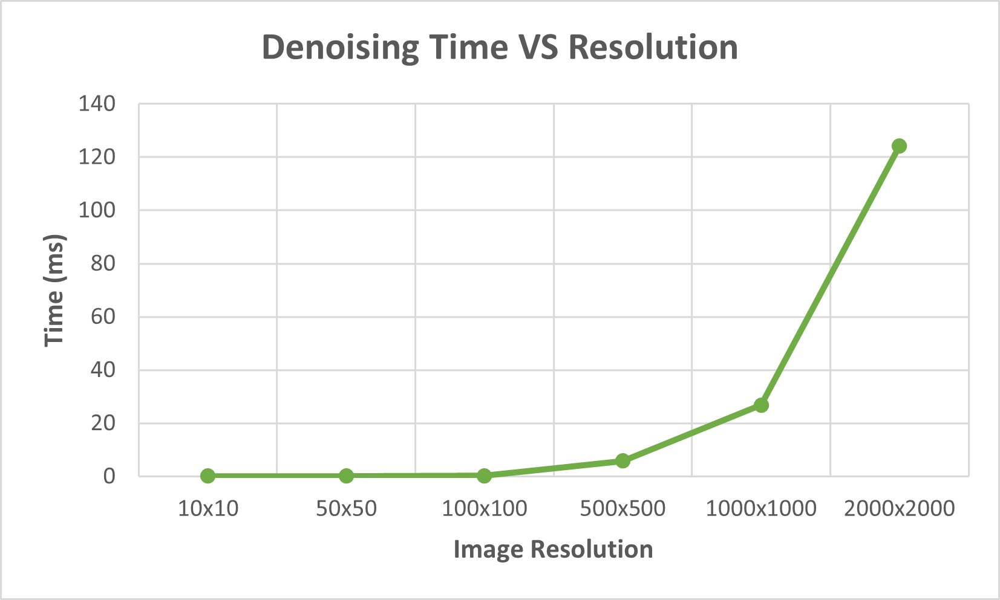 

We see an exponential increase in the render time with the increase in the size of the resolution. While the exponential trend is an interesting revelation, the increase was nonetheless expected because a higher resolution means more pixels to approximate a blur for.

For a better idea on how much fraction of the time we spend on path tracing VS denoising at various resolutions, I use a logarithmic scale to plot the said trend:

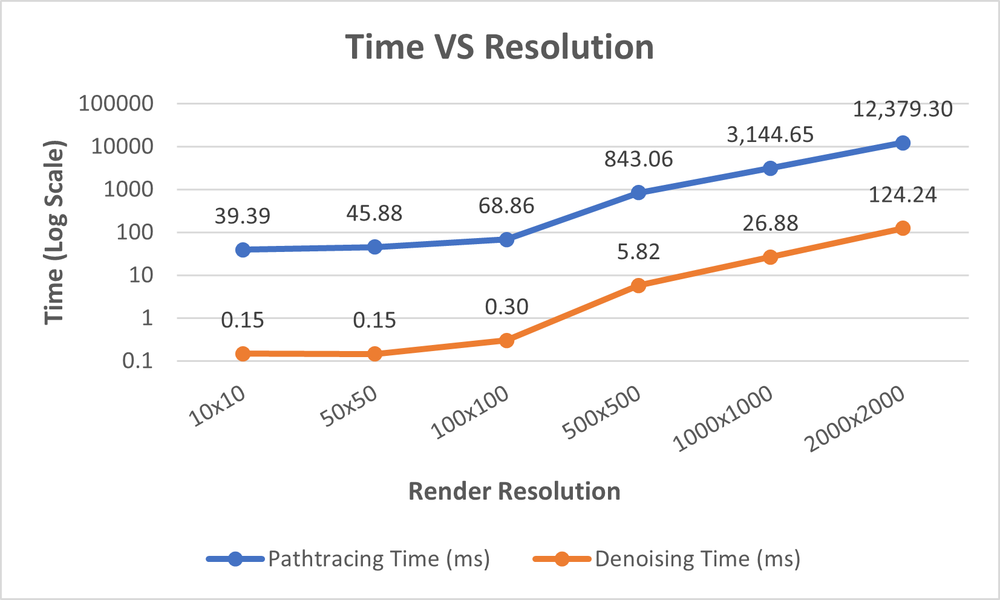 

It is interesting to note that although the scale for the computation time differs significantly for path tracing VS denoising, both follow a very similar increasing trend with respect to the resolution of the final render.

## 3. Filter Size

Finally, we take a look at how various filter sizes contribute to the runtime cost of the denoiser.The following tests were performed on the cornell box scene named `cornell.txt` in the `scenes` directory and at a fixed 1000 iterations for the path tracer:

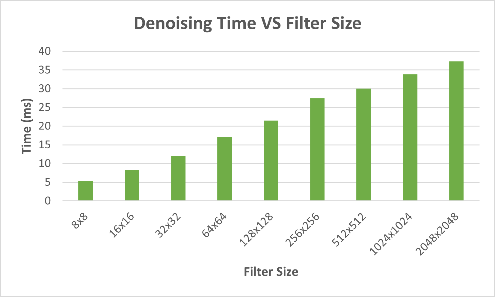 

As expected, a larger filter size makes the denoising algorithm to take longer, since now each pixel needs to consider a much higher number of neighbouring pixels while approximating the edge-avoiding blur.

Similar to the Image Resolution section, I plot the fraction of time spent path tracing VS denosing to visualize how much of a computational hit does the filter size cause:

 

As can be seen from the above graph, we spend a larger and larger fraction of time denoising VS path tracing as the size of our filter increases.
