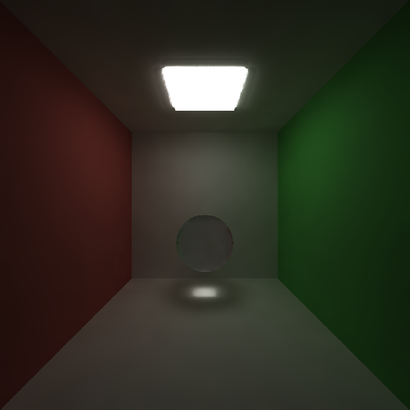

CUDA Denoiser For CUDA Path Tracer
==================================

**University of Pennsylvania, CIS 565: GPU Programming and Architecture, Project 4**

* Saksham Nagpal  
  * [LinkedIn](https://www.linkedin.com/in/nagpalsaksham/)
* Tested on: Windows 11 Home, AMD Ryzen 7 6800H Radeon @ 3.2GHz 16GB, NVIDIA GeForce RTX 3050 Ti Laptop GPU 4096MB

## Summary
This project is a CUDA-based denoiser integrated into my [CUDA Pathtracer](https://github.com/Saksham03/CUDA-Path-Tracer) and is an implementation of the paper [Edge-Avoiding A-Trous Wavelet Transform for fast Global Illumination Filtering](https://jo.dreggn.org/home/2010_atrous.pdf) by the authors Dammertz, Sewtz, Hanika, and Lensch. In summary, the A-Trous Wavelet Transform is essentially a smoothing filter guided by various geometry buffers (G-Buffers). The algorithm is extended to incorporate an edge stopping function based on the input g-buffers that allows successful elimination of noise while preserving sharp edges. I will briefly go over the implementation details followed by an evaluation of the algorithm's qualitative as well as quantitative performance.

## Representative Outcomes  
TODO

# Visual Parity Analysis

## Are the results 'Visually Acceptable'?

| Pathtraced, 1000 iterations | Denoised, 100 iterations |  Difference |
|:--:|:--:|:--:|
|  |  |  |
|  |  |  |
|  |  |  |

| Pathtraced, 5000 iterations | Denoised, 500 iterations |  Difference |
|:--:|:--:|:--:|
|  |  |  |

## Effect of Filter Size

| Filter Size | Resulting Render | Observation |
|:--:|:--:|:--:|
| None (Pathtraced) |  |Noisy render (100 iterations). To compare - visually notable features such as albedo mapping and refractive material|
| 8X8 |  | With a small filter, the effect is limited as the filter spans across very limited pixels. |
| 16X16 |  | Effect a bit more pronounced than the previous filter size, yet effect is limited. |
| 32X32 |  | Better clarity, however the albedo mapping seems to be getting too much blurred out. |
| 64X64 |  | At the cost of clarity, we lose more detail on the refractive material and albedo mapping. |
| 2048X2048 |  | Filter too large, albedos start bleeding over each other and refractive material loses a lot of detail. |

